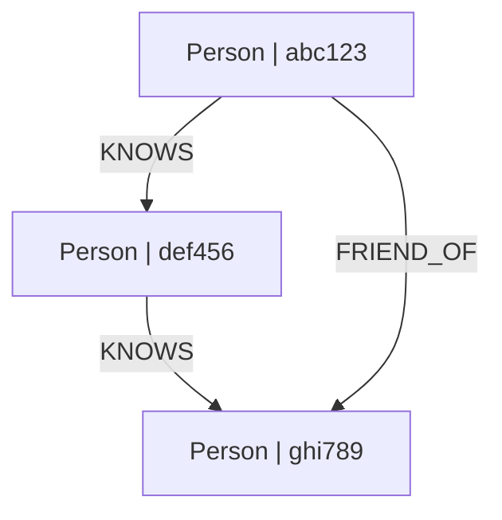

# simple-graphdb

A lightweight **async-first** TypeScript graph database with **pluggable storage architecture**. Supports **multiple isolated graphs** via `graphId` partitioning. Ships with a zero-dependency in-memory provider; optional MongoDB backend for persistence. Includes BFS/DFS traversal, type/property filtering, topological sort, DAG detection, and Mermaid export.

## Features:
### Core
- **Async-first API** — every method returns `Promise<T>`
- **Directed graphs** with typed nodes and relationship-labeled edges
- **Multiple graph support** via `graphId` partitioning (isolated graphs in one instance)
- **Pluggable storage** — swap backends without changing application code

### Storage Providers
- **`InMemoryStorageProvider`** — built-in, zero dependencies, perfect for development/testing
- **`MongoStorageProvider`** — optional MongoDB backend (`>= 5.0.0`), with optimized indexes for nodes and edges

### Traversal & Querying
- **BFS / DFS traversal** — find paths between nodes
- **Wildcard traversal** — `traverse('*', target)`, `traverse(source, '*')`, or `traverse(['a','b'], ['x','y'])`
- **Type filtering** — filter by node types (`['Person', 'Company']`) and edge types (`['KNOWS', 'WORKS_AT']`)
- **Property filtering** — O(1) lookup with property value index
- **Topological sort** — Kahn's algorithm, returns dependency order
- **DAG detection** — cycle detection for acyclic graph validation

### Property Management
- **Flat property structure** — properties must be primitive types only (string, number, boolean, null, undefined, bigint, symbol)
- **Property CRUD** — add, update, delete, and clear properties on nodes and edges
- **Custom indexes** — `createIndex()` for property-specific indexes including compound indexes with type

### Visualization
- **Mermaid export** — generate flowchart diagrams from graph data

### Data Management
- **JSON serialization** — `exportJSON()` / `importJSON()` for backup/restore
- **Deep-frozen properties** — immutability guarantees on node/edge data
- **Graph factories** — `MongoGraphFactory` and `InMemoryGraphFactory` for controlled instance creation


## Installation

```bash
npm install simple-graphdb

# MongoDB backend (optional)
npm install mongodb
```

## Quick Start

```typescript
import { Graph } from 'simple-graphdb';

// Create a new graph (uses InMemoryStorageProvider by default)
const graph = new Graph();

// Add nodes — all methods are async, use await
const pythonCourse = await graph.addNode('Course', { name: 'Python', duration: 40 });
const chapter1     = await graph.addNode('Chapter', { name: 'Basics', order: 1 });
const author       = await graph.addNode('Author', { name: 'John Doe' });

// Add directed edges with relationship types
await graph.addEdge(pythonCourse.id, chapter1.id, 'CONTAINS');
await graph.addEdge(author.id, pythonCourse.id, 'AUTHOR_OF');

// Navigate the graph
const chapters = await graph.getChildren(pythonCourse.id);  // [chapter1]
const courses  = await graph.getParents(author.id);         // [pythonCourse]

// Find nodes by type
const allCourses = await graph.getNodesByType('Course');

// Find path between nodes
const paths = await graph.traverse(pythonCourse.id, chapter1.id, { method: 'bfs' });
// [[courseId, chapterId]]

// Type-filtered traversal
const filtered = await graph.traverse(author.id, pythonCourse.id, {
  nodeTypes: ['Author'],
  edgeTypes: ['AUTHOR_OF']
});

// Wildcard traversal — find all authors of a course
const authorPaths = await graph.traverse('*', pythonCourse.id, {
  edgeTypes: ['AUTHOR_OF']
});
// [[authorId1, courseId], [authorId2, courseId], ...]

// Find all reachable nodes from a source
const allPaths = await graph.traverse(pythonCourse.id, '*');
// [[courseId, child1], [courseId, child2], ...]

// Check if graph is a DAG
const dag = await graph.isDAG(); // true

// Topological sort
const order = await graph.topologicalSort(); // [authorId, courseId, chapterId]
```

## MongoDB Backend

```typescript
import { MongoClient } from 'mongodb';
import { MongoGraphFactory } from 'simple-graphdb';

// Connect to MongoDB
const client = new MongoClient('mongodb://localhost:27017');
await client.connect();

const factory = new MongoGraphFactory(client.db('mydb'));

// Create indexes once at startup (idempotent — safe to call every time)
await factory.ensureIndexes();

// Get a graph scoped to a named partition
const graph = factory.forGraph('my-graph');

const alice = await graph.addNode('Person', { name: 'Alice' });
const bob   = await graph.addNode('Person', { name: 'Bob' });
await graph.addEdge(alice.id, bob.id, 'KNOWS');

const path = await graph.traverse(alice.id, bob.id, { edgeTypes: ['KNOWS'] });

// Caller manages the MongoClient lifecycle
await client.close();
```

### Direct `MongoStorageProvider` Usage

For fine-grained control over collection names, construct the provider directly:

```typescript
import { MongoClient } from 'mongodb';
import { Graph, MongoStorageProvider } from 'simple-graphdb';

const client = new MongoClient('mongodb://localhost:27017');
await client.connect();

const provider = new MongoStorageProvider(client.db('mydb'), {
  graphId: 'my-graph',          // default: 'default' — partitions data by graph id
  nodesCollection: 'my_nodes',  // default: 'sgdb_nodes'
  edgesCollection: 'my_edges',  // default: 'sgdb_edges'
});

await provider.ensureIndexes();

const graph = new Graph(provider);
```

### Indexes Created by `ensureIndexes()`

| Collection | Index | Purpose |
|-----------|-------|---------|
| nodes | `{ graphId: 1, id: 1 }` unique | Fast node id lookups within a graph partition |
| nodes | `{ graphId: 1, type: 1 }` | `getNodesByType()` within a graph partition |
| nodes | `{ graphId: 1, properties: 1 }` | Property value lookups within a graph partition |
| edges | `{ graphId: 1, id: 1 }` unique | Fast edge id lookups within a graph partition |
| edges | `{ graphId: 1, type: 1 }` | `getEdgesByType()` within a graph partition |
| edges | `{ graphId: 1, sourceId: 1, type: 1 }` | Outgoing adjacency queries |
| edges | `{ graphId: 1, targetId: 1, type: 1 }` | Incoming adjacency queries |

## API Reference

All methods return `Promise<T>` — remember to `await` every call.

### Graph Class

#### Constructor

```typescript
new Graph(storageProvider?: IStorageProvider)
```

Omit `storageProvider` to use the built-in `InMemoryStorageProvider`.

#### Node Operations

| Method | Returns | Description |
|--------|---------|-------------|
| `addNode(type, properties?)` | `Promise<Node>` | Add a new node with type label |
| `removeNode(id, cascade?)` | `Promise<boolean>` | Remove node; `cascade=true` removes incident edges |
| `getNode(id)` | `Promise<Node \| undefined>` | Get node by id |
| `hasNode(id)` | `Promise<boolean>` | Check if node exists |
| `getNodes()` | `Promise<readonly Node[]>` | Get all nodes |
| `getNodesByType(type)` | `Promise<Node[]>` | Get all nodes of a given type |
| `getNodesByProperty(key, value, opts?)` | `Promise<Node[]>` | Get nodes by property value, optionally filtered by node type |

#### Node Property Operations

| Method | Returns | Description |
|--------|---------|-------------|
| `addNodeProperty(nodeId, key, value)` | `Promise<void>` | Add a primitive property to a node |
| `updateNodeProperty(nodeId, key, value)` | `Promise<void>` | Update an existing property on a node |
| `deleteNodeProperty(nodeId, key)` | `Promise<void>` | Delete a property from a node |
| `clearNodeProperties(nodeId)` | `Promise<void>` | Remove all properties from a node |
| `createIndex('node', propertyKey, type?)` | `Promise<void>` | Create index on node property, optionally compound with type |

#### Edge Operations

| Method | Returns | Description |
|--------|---------|-------------|
| `addEdge(sourceId, targetId, type, properties?)` | `Promise<Edge>` | Add a directed edge with relationship type |
| `removeEdge(id)` | `Promise<boolean>` | Remove edge by id |
| `getEdge(id)` | `Promise<Edge \| undefined>` | Get edge by id |
| `hasEdge(id)` | `Promise<boolean>` | Check if edge exists |
| `getEdges()` | `Promise<readonly Edge[]>` | Get all edges |
| `getEdgesByType(type)` | `Promise<Edge[]>` | Get all edges of a given relationship type |

#### Edge Property Operations

| Method | Returns | Description |
|--------|---------|-------------|
| `addEdgeProperty(edgeId, key, value)` | `Promise<void>` | Add a primitive property to an edge |
| `updateEdgeProperty(edgeId, key, value)` | `Promise<void>` | Update an existing property on an edge |
| `deleteEdgeProperty(edgeId, key)` | `Promise<void>` | Delete a property from an edge |
| `clearEdgeProperties(edgeId)` | `Promise<void>` | Remove all properties from an edge |
| `createIndex('edge', propertyKey, type?)` | `Promise<void>` | Create index on edge property, optionally compound with type |

#### Navigation

| Method | Returns | Description |
|--------|---------|-------------|
| `getParents(nodeId, opts?)` | `Promise<Node[]>` | Get parent nodes with optional type filters |
| `getChildren(nodeId, opts?)` | `Promise<Node[]>` | Get child nodes with optional type filters |
| `getEdgesFrom(sourceId, opts?)` | `Promise<Edge[]>` | Get outgoing edges with optional type filter |
| `getEdgesTo(targetId, opts?)` | `Promise<Edge[]>` | Get incoming edges with optional type filter |
| `getDirectEdgesBetween(sourceId, targetId, opts?)` | `Promise<Edge[]>` | Get direct edges between two nodes |

#### Traversal & Analysis

| Method | Returns | Description |
|--------|---------|-------------|
| `traverse(sourceId, targetId, opts?)` | `Promise<string[][] \| null>` | Find path(s) between nodes using BFS or DFS |
| `isDAG()` | `Promise<boolean>` | Check if graph is a Directed Acyclic Graph |
| `topologicalSort()` | `Promise<string[] \| null>` | Topological order; `null` if cycles exist |

#### TraversalOptions Interface

```typescript
interface TraversalOptions {
  method?: 'bfs' | 'dfs';    // default: 'bfs'
  nodeTypes?: string[];       // filter traversal to these node types (default: all)
  edgeTypes?: string[];       // filter traversal to these edge types (default: all)
  maxResults?: number;        // limit number of paths (default: 100)
}
```

#### Wildcard Support

The `traverse()` method supports wildcards for flexible path finding:

```typescript
// Find a path to a specific target from every node
await graph.traverse('*', targetId);

// Find a path from a specific source to every reachable target
await graph.traverse(sourceId, '*');

// Find paths for every source/target pair in the graph
await graph.traverse('*', '*');

// Find paths for each combination across two arrays
await graph.traverse(['id1', 'id2'], ['id3', 'id4']);
```

#### Serialization & Admin

| Method | Returns | Description |
|--------|---------|-------------|
| `exportJSON()` | `Promise<GraphData>` | Serialize graph to JSON-compatible object |
| `static importJSON(data, storageProvider?)` | `Promise<Graph>` | Reconstruct graph from data |
| `clear()` | `Promise<void>` | Remove all nodes and edges |

### GraphToMermaid — Mermaid Diagram Generation

Convert your graph to Mermaid flowchart syntax for visualization:

```typescript
import { Graph, GraphToMermaid } from 'simple-graphdb';

const graph = new Graph();
const alice = await graph.addNode('Person', { name: 'Alice' });
const bob   = await graph.addNode('Person', { name: 'Bob' });
const carol = await graph.addNode('Person', { name: 'Carol' });

await graph.addEdge(alice.id, bob.id, 'KNOWS');
await graph.addEdge(bob.id, carol.id, 'KNOWS');
await graph.addEdge(alice.id, carol.id, 'FRIEND_OF');

// Async static factory — awaits graph.exportJSON() internally
const mermaid = await GraphToMermaid.fromGraph(graph);
console.log(mermaid.toString());
```

Output:


You can also construct from serialized JSON synchronously:

```typescript
const json = await graph.exportJSON();
const mermaid = new GraphToMermaid(JSON.stringify(json));
// or
const mermaid2 = new GraphToMermaid(json);
```

#### GraphToMermaid Options

| Option | Type | Default | Description |
|--------|------|---------|-------------|
| `showProperties` | `boolean` | `false` | Include node properties in labels |
| `includeEdgeLabels` | `boolean` | `true` | Show edge types on arrows |
| `direction` | `'TD' \| 'LR'` | `'TD'` | Flowchart direction (top-down or left-right) |

```typescript
const mermaid = await GraphToMermaid.fromGraph(graph, {
  showProperties: true,
  includeEdgeLabels: true,
  direction: 'LR'
});
```

### Node Class

```typescript
const node = await graph.addNode('Course', { name: 'Python', duration: 40 });

node.id;         // 'uuid-xxxx-xxxx'
node.type;       // 'Course'
node.properties; // { name: 'Python', duration: 40 }
node.toJSON();   // { id: '...', type: 'Course', properties: { ... } }
```

### Edge Class

```typescript
const edge = await graph.addEdge(sourceId, targetId, 'CONTAINS', { order: 1 });

edge.id;          // 'uuid-xxxx-xxxx'
edge.sourceId;    // 'source-node-id'
edge.targetId;    // 'target-node-id'
edge.type;        // 'CONTAINS'
edge.properties;  // { order: 1 }
edge.toJSON();    // { id: '...', sourceId: '...', targetId: '...', type: 'CONTAINS', properties: { order: 1 } }
```

## Error Handling

```typescript
import { Graph, NodeAlreadyExistsError, NodeNotFoundError, NodeHasEdgesError } from 'simple-graphdb';

const graph = new Graph();
const alice = await graph.addNode('Person', { name: 'Alice' });
const bob   = await graph.addNode('Person', { name: 'Bob' });
await graph.addEdge(alice.id, bob.id, 'KNOWS');

// NodeHasEdgesError — node has incident edges
try {
  await graph.removeNode(alice.id); // throws
} catch (e) {
  if (e instanceof NodeHasEdgesError) {
    console.log(e.message); // "Cannot remove node '...': it still has 1 incident edge(s)..."
  }
}

// Cascade delete — removes node AND all incident edges
await graph.removeNode(alice.id, true);

// importJSON validation
try {
  const data = {
    nodes: [
      { id: 'same-id', type: 'A', properties: {} },
      { id: 'same-id', type: 'B', properties: {} },  // duplicate
    ],
    edges: [],
  };
  await Graph.importJSON(data); // throws NodeAlreadyExistsError
} catch (e) {
  if (e instanceof NodeAlreadyExistsError) {
    console.log(e.message); // "Node with id 'same-id' already exists"
  }
}
```

Available error classes:
- `NodeAlreadyExistsError`
- `EdgeAlreadyExistsError`
- `NodeNotFoundError`
- `EdgeNotFoundError`
- `NodeHasEdgesError` — thrown by `removeNode(id)` when the node has incident edges and `cascade` is not `true`
- `InvalidGraphDataError`
- `InvalidPropertyError` — thrown when property value is not a primitive type
- `PropertyAlreadyExistsError` — thrown by `addNodeProperty`/`addEdgeProperty` when property already exists
- `PropertyNotFoundError` — thrown by `updateNodeProperty`/`updateEdgeProperty` when property does not exist

## Serialization & Persistence

```typescript
import { Graph } from 'simple-graphdb';
import fs from 'fs/promises';

const graph = new Graph();
// ... build your graph ...

// Export to JSON (async)
const data = await graph.exportJSON();
await fs.writeFile('graph.json', JSON.stringify(data, null, 2));

// Import from JSON (async static method)
const raw = JSON.parse(await fs.readFile('graph.json', 'utf-8'));
const restored = await Graph.importJSON(raw);
```

## Cascade Delete

By default, removing a node with incident edges throws `NodeHasEdgesError`. Pass `cascade: true` to also remove all incident edges:

```typescript
const a = await graph.addNode('Person', { name: 'A' });
const b = await graph.addNode('Person', { name: 'B' });
const edge = await graph.addEdge(a.id, b.id, 'KNOWS');

// Without cascade — throws NodeHasEdgesError
try {
  await graph.removeNode(a.id);
} catch (e) { /* NodeHasEdgesError */ }

// With cascade — removes node AND edge
await graph.removeNode(a.id, true);
await graph.hasEdge(edge.id); // false
```

## Pluggable Storage Architecture

All storage backends implement the `IStorageProvider` interface:

```typescript
import type { IStorageProvider } from 'simple-graphdb';

class MyCustomProvider implements IStorageProvider {
  async insertNode(node: NodeData): Promise<void> { /* ... */ }
  async deleteNode(id: string): Promise<void> { /* ... */ }
  async hasNode(id: string): Promise<boolean> { /* ... */ }
  async getNode(id: string): Promise<NodeData | undefined> { /* ... */ }
  async getAllNodes(limit?: number): Promise<NodeData[]> { /* ... */ }
  async getNodesByType(type: string): Promise<NodeData[]> { /* ... */ }
  async getNodesByProperty(key: string, value: unknown, nodeType?: string): Promise<NodeData[]> { /* ... */ }
  async insertEdge(edge: EdgeData): Promise<void> { /* ... */ }
  async deleteEdge(id: string): Promise<void> { /* ... */ }
  async hasEdge(id: string): Promise<boolean> { /* ... */ }
  async getEdge(id: string): Promise<EdgeData | undefined> { /* ... */ }
  async getAllEdges(): Promise<EdgeData[]> { /* ... */ }
  async getEdgesByType(type: string): Promise<EdgeData[]> { /* ... */ }
  async getEdgesBySource(nodeId: string, type?: string): Promise<EdgeData[]> { /* ... */ }
  async getEdgesByTarget(nodeId: string, type?: string): Promise<EdgeData[]> { /* ... */ }
  async createIndex(target: 'node' | 'edge', propertyKey: string, type?: string): Promise<void> { /* ... */ }
  async addProperty(target: 'node' | 'edge', id: string, key: string, value: unknown): Promise<void> { /* ... */ }
  async updateProperty(target: 'node' | 'edge', id: string, key: string, value: unknown): Promise<void> { /* ... */ }
  async deleteProperty(target: 'node' | 'edge', id: string, key: string): Promise<void> { /* ... */ }
  async clearProperties(target: 'node' | 'edge', id: string): Promise<void> { /* ... */ }
  async exportJSON(): Promise<GraphData> { /* ... */ }
  async importJSON(data: GraphData): Promise<void> { /* ... */ }
  async clear(): Promise<void> { /* ... */ }
}

const graph = new Graph(new MyCustomProvider());
```

## Development

```bash
# Install dependencies
npm install

# Build TypeScript
npm run build

# Run tests (134 tests)
npm test
```

## Testing

The test suite (134 tests across 17 suites) runs against both `InMemoryStorageProvider` and `MongoStorageProvider` backends:

### In-Memory Tests
- `tests/graph/Graph.node.test.ts` — Node operations
- `tests/graph/Graph.edge.test.ts` — Edge operations
- `tests/graph/Graph.traverse.test.ts` — BFS/DFS traversal
- `tests/graph/Graph.serialization.test.ts` — Serialization round-trip
- `tests/graph/Graph.isDAG.test.ts` — Cycle detection
- `tests/graph/Graph.topologicalSort.test.ts` — Topological ordering
- `tests/graph/Graph.fromJSON.test.ts` — JSON validation
- `tests/graph/Graph.clear.test.ts` — Graph clearing
- `tests/graph/Graph.properties.test.ts` — Property CRUD and validation
- `tests/graph/GraphToMermaid.test.ts` — Mermaid export

### Cross-Provider Scenarios (InMemory + MongoDB)
- `tests/EducationGraph.inmemory.test.ts` — Education graph via InMemory provider
- `tests/EducationGraph.mongo.test.ts` — Education graph via MongoDB provider
- `tests/SocialGraph.inmemory.test.ts` — Social graph via InMemory provider
- `tests/SocialGraph.mongo.test.ts` — Social graph via MongoDB provider

### Storage Provider Tests
- `tests/storage/MongoStorageProvider.test.ts` — MongoDB provider unit tests (isolation, indexing)
- `tests/storage/MongoGraphFactory.test.ts` — MongoDB factory lifecycle tests
- `tests/storage/InMemoryGraphFactory.test.ts` — In-memory factory tests

## License

MIT
