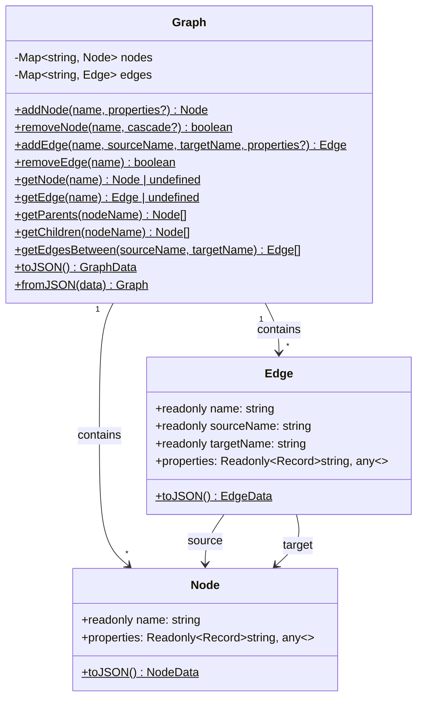

# GraphDB Package Specification

## Project Overview
A lightweight in-memory graph database npm package written in TypeScript with object-oriented design, implementing basic features.

## Architecture Overview



## Type Definitions

### NodeData
```typescript
interface NodeData {
  name: string;
  properties: Record<string, unknown>;
}
```

### EdgeData
```typescript
interface EdgeData {
  name: string;
  sourceName: string;
  targetName: string;
  properties: Record<string, unknown>;
}
```

### GraphData
```typescript
interface GraphData {
  nodes: NodeData[];
  edges: EdgeData[];
}
```

## Class Specifications

### Node Class (`src/Node.ts`)

**Responsibilities:**
- Store node identity (unique string name)
- Store arbitrary JSON properties (immutable after creation)
- Provide serialization to JSON

**Public API:**
- `constructor(name: string, properties?: Record<string, unknown>)` - Create a node with name and optional properties
- `get name(): string` - Read-only node name
- `get properties(): Readonly<Record<string, unknown>>` - Read-only properties
- `toJSON(): NodeData` - Serialize to JSON-compatible format

### Edge Class (`src/Edge.ts`)

**Responsibilities:**
- Store edge identity (unique string name)
- Store source and target node names (references, not objects)
- Store arbitrary JSON properties (immutable after creation)
- Provide serialization to JSON

**Public API:**
- `constructor(name: string, sourceName: string, targetName: string, properties?: Record<string, unknown>)` - Create an edge
- `get name(): string` - Read-only edge name
- `get sourceName(): string` - Read-only source node reference
- `get targetName(): string` - Read-only target node reference
- `get properties(): Readonly<Record<string, unknown>>` - Read-only properties
- `toJSON(): EdgeData` - Serialize to JSON-compatible format

### Graph Class (`src/Graph.ts`)

**Responsibilities:**
- Manage collection of nodes and edges
- Enforce referential integrity for edges (source/target must exist)
- Provide navigation methods
- Handle cascade deletion
- Serialize/deserialize entire graph state

**Public API:**

| Method | Description | Returns |
|--------|-------------|---------|
| `addNode(name: string, properties?: Record<string, unknown>): Node` | Add a new node | Created Node |
| `removeNode(name: string, cascade?: boolean): boolean` | Remove node; cascade removes incident edges | Success |
| `addEdge(name: string, sourceName: string, targetName: string, properties?: Record<string, unknown>): Edge` | Add directed edge | Created Edge |
| `removeEdge(name: string): boolean` | Remove edge by name | Success |
| `getNode(name: string): Node \| undefined` | Retrieve node by name | Node or undefined |
| `getEdge(name: string): Edge \| undefined` | Retrieve edge by name | Edge or undefined |
| `hasNode(name: string): boolean` | Check if node exists | boolean |
| `hasEdge(name: string): boolean` | Check if edge exists | boolean |
| `getNodes(): readonly Node[]` | Get all nodes | Array of Nodes |
| `getEdges(): readonly Edge[]` | Get all edges | Array of Edges |
| `getParents(nodeName: string): Node[]` | Get parent nodes (nodes that have edges pointing TO this node) | Parent nodes |
| `getChildren(nodeName: string): Node[]` | Get child nodes (nodes this node points TO) | Child nodes |
| `getEdgesFrom(sourceName: string): Edge[]` | Get all edges originating from node | Outgoing edges |
| `getEdgesTo(targetName: string): Edge[]` | Get all edges pointing to node | Incoming edges |
| `getEdgesBetween(sourceName: string, targetName: string): Edge[]` | Get edges between two nodes | Edges array |
| `clear(): void` | Remove all nodes and edges | void |
| `toJSON(): GraphData` | Serialize entire graph | JSON-compatible data |
| `static fromJSON(data: GraphData): Graph` | Factory to reconstruct graph | New Graph instance |

**Error Handling:**
- Throw `NodeAlreadyExistsError` when adding duplicate node
- Throw `EdgeAlreadyExistsError` when adding duplicate edge
- Throw `NodeNotFoundError` when source/target node doesn't exist for edge
- Throw `NodeNotFoundError` when operating on non-existent node

## Folder Structure

```
e:/Projects/graph/
├── package.json
├── tsconfig.json
├── src/
│   ├── index.ts              # Main export file
│   ├── Node.ts               # Node class
│   ├── Edge.ts               # Edge class
│   ├── Graph.ts              # Graph class
│   ├── types.ts              # Type definitions and interfaces
│   └── errors.ts             # Custom error classes
├── tests/
│   └── Graph.test.ts         # Unit tests
├── examples/
│   └── demo.ts               # Usage demonstration script
└── plans/
    └── plan.md               # This specification
```

## Package Configuration

### package.json
- **name**: `simple-graphdb`
- **version**: `1.0.0`
- **main**: `dist/index.js`
- **types**: `dist/index.d.ts`
- **scripts**:
  - `build`: `tsc`
  - `test`: `jest`
  - `example`: `ts-node examples/demo.ts`

### tsconfig.json
- Target: ES2020
- Module: ES2022
- Strict mode enabled
- Declaration files generation enabled
- OutDir: dist/

## Test Coverage

Tests should cover:
1. Node creation with/without properties
2. Edge creation with node validation
3. Node removal with cascade option
4. Edge removal
5. Node retrieval
6. Edge retrieval
7. Parent/child navigation
8. Serialization round-trip
9. Factory method reconstruction
10. Error cases (duplicate names, missing nodes)

## Example Usage

```typescript
import { Graph } from '@graphdb/core';

// Create a new graph
const graph = new Graph();

// Add nodes
graph.addNode('Alice', { age: 30, city: 'NYC' });
graph.addNode('Bob', { age: 25, city: 'LA' });
graph.addNode('Charlie', { age: 35, city: 'Chicago' });

// Add edges (relationships)
graph.addEdge('Alice-likes-Bob', 'Alice', 'Bob', { since: 2020 });
graph.addEdge('Bob-loves-Charlie', 'Bob', 'Charlie', { intensity: 'high' });

// Navigate
const parentsOfBob = graph.getParents('Bob');     // [Alice]
const childrenOfAlice = graph.getChildren('Alice'); // [Bob]

// Serialize
const data = graph.toJSON();

// Restore from data
const restored = Graph.fromJSON(data);
```
